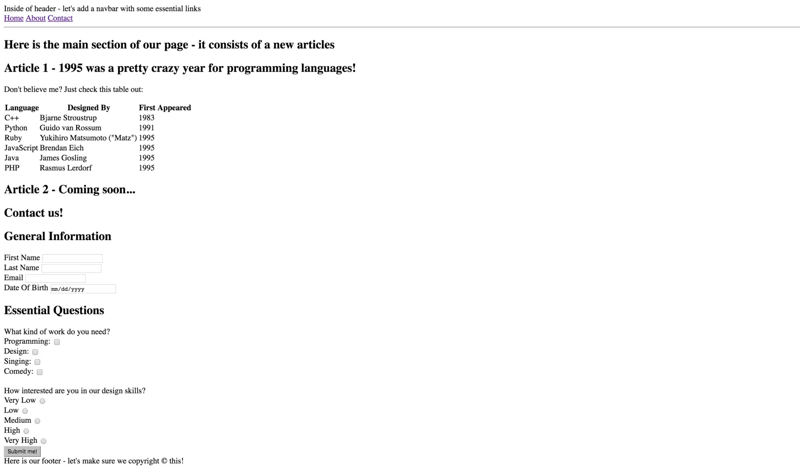
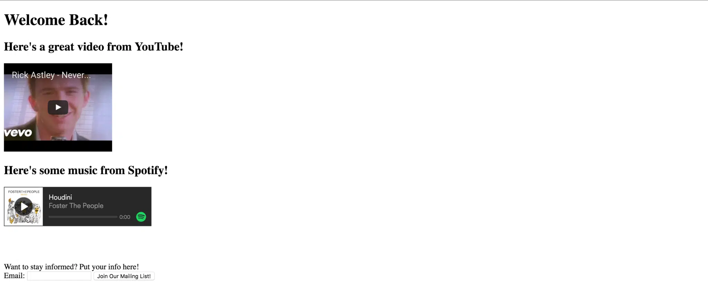

# Intermediate HTML Exercise

## Part 1

Write the necessary HTML to make your page look just like this one:

## Part 2

Write the necessary HTML to make your page look just like this one:

Don’t worry about the song / video being the same – you can use whatever video you’d like!

You can find the solutions [here](https://github.com/Codust-SIR/Codust-Tutorial/tree/main/solutions/intermediate_html)
