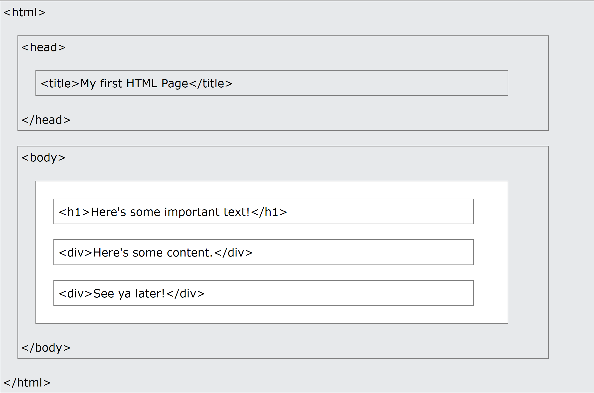

# Introduction to HTML

## Objectives

By the end of this chapter, you should be able to:

1. Create simple pages using only HTML
2. Explain the structure of an HTML Document
3. Describe the difference between an element and an attribute

## Getting started with HTML

HTML, which stands for **H**yper **T**ext **M**arkup **L**anguage, is one of the fundamental building blocks of the web. When you visit a webpage, your browser reads HTML and renders the document on the page. HTML is primarily responsible for holding the content of a page; the styling is defined by CSS, and much of the interactivity is controlled by JavaScript (we’ll get to these technologies soon enough).

There are many reference materials on HTML and its history. If you’d like to learn more, check out [Wikipedia](https://en.wikipedia.org/wiki/HTML#History) or the [MDN docs](https://developer.mozilla.org/en-US/docs/Web/HTML). For now, let’s learn about HTML by actually writing some HTML!

## The Structure of HTML

If you’ve never seen HTML before, one of the first things you’ll notice is probably the number of elements, which are the building blocks of HTML. We specify the name of the element using its name along with opening and closing brackets (<>). To denote the ending of a tag, we use </>. Here’s a basic HTML document:

```html
<!DOCTYPE html>
<html lang="en">
<head>
  <meta charset="UTF-8">
  <title>My first HTML page!</title>
</head>
<body>
  <h1>Here's some important text!</h1>
  <div>Here's some content.</div>
  <div>See ya later!</div>
</body>
</html>

```

In the above example, we see a number of elements: `html`, `head`, `meta`, `title`, and so on. We’ll see more elements as we learn more about HTML.

Notice that sometimes elements are nested inside of other elements. `meta` and `title` are inside of `head`, `h1` is inside of `body`, and everything is inside of `html`. These are commonly referred to in the language of parents and children: we say that the h1 element is a child of the `body` element, for example, and that the `body` element is the parent of the `h1` element. Elements with the same parent are called siblings; the `meta` and `title` tags are siblings in the document above.

In fact, you can think of the entire structure of an HTML document in terms of these relationships. From this perspective, the document looks like a tree, with parent nodes higher up on the tree, and child nodes down below. Here’s an example of how you could visualize the structure of the HTML file above:



## Doctype and essential tags

Another essential building block for our web pages is to specify the `doctype` declaration, which tells the browser that the page is written in HTML. We will be using `<!DOCTYPE html>` to tell the page that we are using HTML5. This line about the doctype will be your first line in basically all of the HTML files that you write, and you won’t need to modify it. If you’d like to read more about the doctype, check out this Stack Overflow post.

After the doctype declaration, you’ll see a few essential tags across all of the HTML files you come across:

`<html>` – This is where we place all of our elements that comprise the contents of our page.
`<head>` – This is the container for the elements that have content that does not need to be displayed on the page (like metadata, the title, or, as we will see, scripts and stylesheets).
`<meta>` – This is a tag for providing metadata (data about our data) to the page. We can use meta tags to display what character set we are using or for SEO (Search Engine Optimization) purposes.
`<title>` – This tag gives the page a title that can be displayed in the tab of your browser.
`<body>` – This defines the main content of the HTML page.

We’ll discuss the elements inside of the body tag in a later chapter.

## Attributes and Content

Our sample HTML page contains a number of elements. Some of those elements contain content: for instance, the content of the h1 tag is the text “Here’s some important text!” Some elements also contain attributes, which are used to provide additional information about an element. The attributes are always set inside of the opening tag of the element, and take the form attribute_name="attribute value". In our sample HTML, there are two attributes:

The html tag has a lang attribute set to "en". This tells the browser that the HTML document is written in English. This will probably be the default you’ll want for all of the web pages you create. For more on the lang attribute, check out this article.
The meta tag has a charset attribute of "UTF-8". This specifies the character encoding for the file. You don’t need to worry too much about this for now, but if you’d like to learn more about UTF-8, you can start with this Wikipedia article.
We’ll see many other attributes as we start writing more HTML. For example, when you create a link using an a tag, you’ll pass in the webpage the link should point to as an attribute. The same thing applies when you create an image using the img tag and need to point to the URL for the image.

## Headings, Paragraphs, Breaks and horizontal rows

In HTML we have quite a few ways to display and separate text. We have heading tags` <h1></h1>`, `<h2></h2>`, …, `<h6></h6>` (h1 tags are the largest, h6 are the smallest), paragraph tags `<p></p>`, line breaks `<br>` (notice that this tag does not close), and horizontal rows `<hr>` (this tag does not close as well). You’ll commonly see heading tags used for titles of pages and sections, while `p` tags are used for larger chunks of text.

## Lists in HTML

What if you don’t want to write paragraphs, but instead just want to display some simple lists? To create list items in HTML, we can either use ordered lists or unordered lists:

```html
<ol>
  <li>First</li>
  <li>Second</li>
  <li>Third</li>
</ol>

<ul>
  <li>Something Not Ordered</li>
  <li>Something Not Ordered</li>
  <li>Something Not Ordered</li>
</ul>
```

By default, ordered lists will be numbered starting from 1. You can change the numbering by setting the type attribute on the list. What do you think the ordering will look like for each of the following lists?

```html
<ol type="A">
  <li>First</li>
  <li>Second</li>
  <li>Third</li>
</ol>

<ol type="a">
  <li>First</li>
  <li>Second</li>
  <li>Third</li>
</ol>

<ol type="I">
  <li>First</li>
  <li>Second</li>
  <li>Third</li>
</ol>

<ol type="i">
  <li>First</li>
  <li>Second</li>
  <li>Third</li>
</ol>
```

## Divs + Spans

In HTML there are two important tags which do not have much semantic significance, but are useful for laying out a page. These tags are `<div></div>` and `<span></span>`. Both can be used to format text, but they behave differently on the page. Try pasting the following into an HTML document, and take a look at how your browser renders the text:

```html
<div>I'm in a div.</div>
<div>I'm in a div as well.</div>
<span>I'm in a span.</span>
<span>I'm in a span as well.</span>
```

What are some differences you notice?

1. `<div>`: The `<div>` (short for "division") element is a block-level element that is commonly used to create divisions or containers for organizing and grouping other elements. It is a generic container that doesn't carry any inherent meaning or styling. You can think of it as a rectangular box that can be styled, positioned, and manipulated independently. It's often used to create layout structures and apply CSS styles or JavaScript interactions to a group of related elements.

2. `<span>`: The `<span>` element is an inline-level element used to mark a section of text or a small inline content within a larger block of text. Unlike `<div>`, it doesn't create a visual break or new line by default. It is often used for applying styles or targeting specific sections of text using CSS or JavaScript. It doesn't imply any semantic meaning and is generally used for manipulating or styling purposes.

3. Text modifications
To change the look of text on the page we can use tags like `<b></b>`, `<u></u>`, `<em></em>`, `<small></small>`, `<sup></sup>`, `<sub></sub>`, `<blockquote></blockquote>` and `<cite></cite>`. Take a look at what these do!

```html
<!DOCTYPE html>
<html>
<head>
  <title>HTML Element Examples</title>
</head>
<body>
  <h1>HTML Element Examples</h1>

  <p>This is an example of using some HTML elements:</p>

  <b>This text is bold.</b><br>
  <u>This text is underlined.</u><br>
  <em>This text is emphasized.</em><br>
  <small>This text is smaller.</small><br>
  <sup>This text is superscripted.</sup><br>
  <sub>This text is subscripted.</sub><br>
  
  <blockquote>
    This is a blockquote. It is used to indicate a longer quotation or a section that is quoted from another source.
  </blockquote>

  <cite>This is the citation for the blockquote.</cite>

</body>
</html>
```

## Text modifications

To change the look of text on the page we can use tags like `<b></b>`, `<u></u>`, `<em></em>`, `<small></small>`, `<sup></sup>`, `<sub></sub>`, `<blockquote></blockquote>` and `<cite></cite>`. Take a look at what these do!

## Anchor tags

When we want to create hyperlinks to other pages, we use an anchor tag `<a></a>`. To specify what link we want to go to we use the href attribute. For example, to add an anchor tag linking to Google, we would write something like `<a href="http://www.google.com">Go To Google!</a>`

## Images

We can add images and specify their source using the src attribute. Another important attribute for image tags is the alt attribute which is what is displayed when the image fails to load and is very important for SEO purposes as well. It looks something like this: ``

When you’re ready, move on to Emmet
